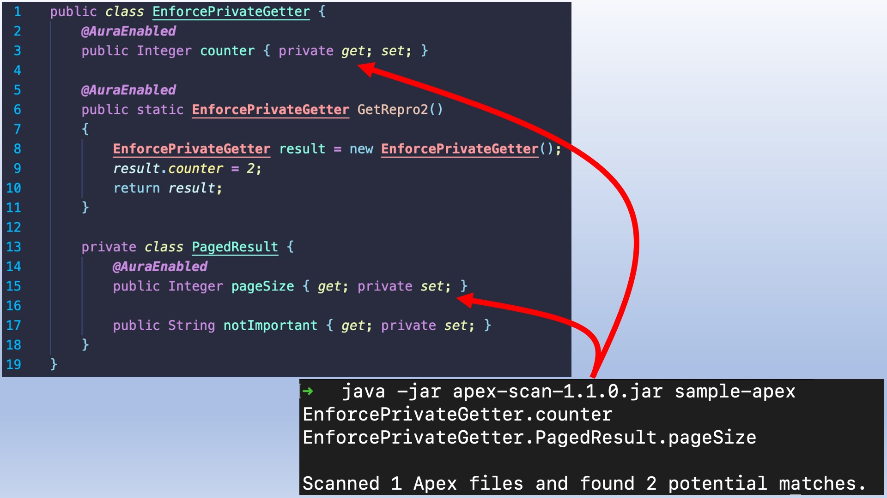

# Helper script for Salesforce Summer '21 Apex security update

In the Salesforce Summer '21 release, a [security update](https://help.salesforce.com/articleView?id=release-notes.rn_lc_enforce_prop_modifiers_cruc.htm&type=5&release=232) will enforce access modifiers on Apex properties in Lightning component markup.

This repository holds a script that will help you locate affected Apex methods.




**ℹ️&nbsp;&nbsp;Disclaimer:** this tool is not officially supported by Salesforce and is provided as-is without any warranties.

## Requirements

A Java JDK or JRE version 11 or higher.

## Instructions

1. Download the `apex-scan-x.y.z.jar` file from the [releases](https://github.com/pozil/apex-security-update-summer21/releases/latest).

1. Run the JAR file with the following command where `PATH` is the path of a parent directory that contains apex `*.cls` files. The parent directory will be scanned recursively for these files.

    ```shell
    $> java -jar apex-scan-1.2.0.jar PATH
    ```

	Look at the output of the script. It lists methods affected by the security update.

    For reference, this is the output for the `sample-apex` folder contained in this repository:

    ```shell
    $> java -jar apex-scan-1.2.0.jar sample-apex
    EnforcePrivateGetter.counter
    EnforcePrivateGetter.PagedResult.pageSize
    
    Scanned 1 Apex files and found 2 potential matches.
    ```

## License

This program uses the [Apex Language Server](https://developer.salesforce.com/tools/vscode/en/apex/language-server) writen by Salesforce.com and licensed under the BSD 3-Clause license.
For full license text, see LICENSE.txt file in the repo root or https://opensource.org/licenses/BSD-3-Clause
